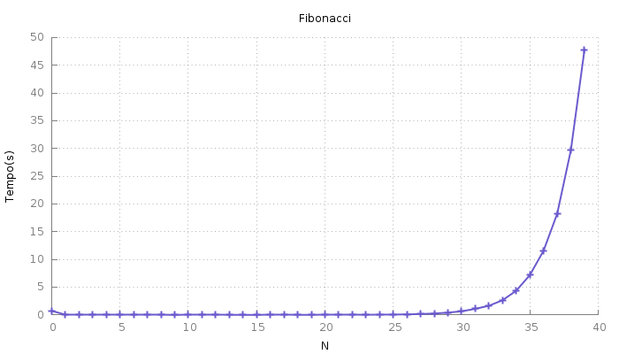
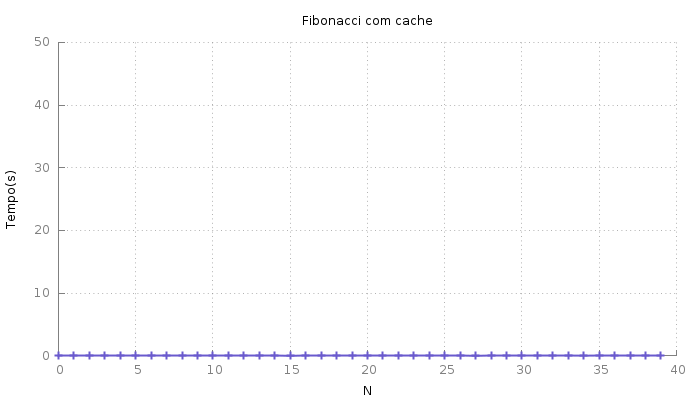
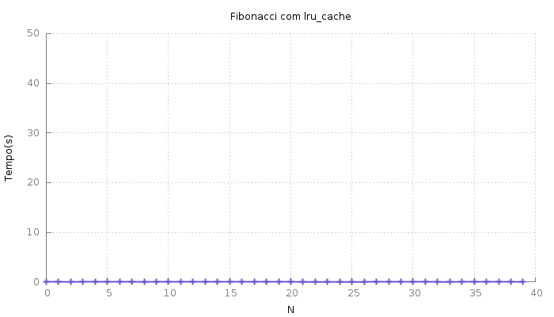

Title: Acelerando Fibonacci com cache
Date: 17-07-2016 17:27
Modified: 19-07-2016 22:35
Category: Programação
Tags: Python, Cache, Programação Dinâmica

## Programação Dinâmica
No campo de teoria da computação é comum ouvir o termo _Programação Dinâmica_.
Pessoalmente achei bastante difícil entender este conceito. Todos os
lugares que procurava via exemplos usando matrizes, o que deixava o
código bastante confuso. Finalmente, depois de algumas semanas, entendi
do que se tratava.

Programação dinâmica é uma técnica de desenvolvimento de algoritmos que
divide o problema em questão, salva as soluções destes subproblemas e
as combina para resolver o problema maior.

A parte de dividir o problema em problemas menores é bastante comum em
algoritmos do tipo _dividir-e-conquistar_, mas estes não necessariamente
salvam as soluções dos subproblemas, pois costumam ser resolvidos
apenas uma vez cada. Algoritmos que fazem uso do _Programação Dinâmica_
apresentam sobreposição na árvore de recursão e, para evitar resolver
mais de uma vez um subproblema, salvamos seu resultado em uma espécie de [cache](https://pt.wikipedia.org/wiki/Cache).

## Fibonnaci
Um exemplo bem simples de problema que pode fazer uso de programação
dinâmica é o de se calcular o enésimo elemento da [_Sequência de Fibonacci_](https://pt.wikipedia.org/wiki/Sequ%C3%AAncia_de_Fibonacci).

Uma solução para este problema é:
```python
def fibonacci(n):
    if n < 2:
        return n
    return fibonacci(n - 1) + fibonacci(n - 2)
```
Temos os resultados:
```python
>>> res = [fibonacci(i) for i in range(11)]
>>> res
[0, 1, 1, 2, 3, 5, 8, 13, 21, 34, 55]
```
Esta solução funciona, claramente. O problema é, como existe uma
sobreposição dos subproblemas (fibonacci(n - 1) chamará a função com
o mesmo valor que sua chamada "irmã" fibonacci(n - 2)), vários
subproblemas estão sendo resolvidos inúmeras vezes. Fazendo com que
esta soluçã não escale bem.

Testei a solução acima com vários valores de entrada e medi os tempos
de execução. São eles:

Podemos melhorar o desempenho salvando os resultados parciais em um
`cache`, uma estrutura de dados auxiliar. Algo como:
```python
cache = {}
def fibonacci_cached(n):
    if n in cache:
        return cache[n]

    if n < 2:
        cache[n] = n
    else:
        cache[n] = fibonacci_cached(n - 1) + fibonacci_cached(n - 2)
    return cache[n]
```
Esta segunda solução também funciona:
```python
>>> res = [fibonacci_cached(i) for i in range(11)]
>>> res
[0, 1, 1, 2, 3, 5, 8, 13, 21, 34, 55]
```
E em tempo muito melhor:


O tempo não é zero, apenas mantive a escala do gráfico anterior para
tornar a diferença graficamente notável.

Apesar da melhoria em desempenho, a solução com cache não é muito agradável.
Não é muito aconselhável fazer uso de variáveis globais. Este problema
pode ser superado fazendo uso de classe ou, de forma mais pythonica,
`decorator`.

Fazer uso destas ferramentas mais avançadas adicionaria,
sem sombra de dúvida, complexidade ao código. Felizmente a biblioteca
padrão do python oferece um `decorator` justamente para este tipo de situação.
O [`lru_cache`](https://docs.python.org/3/library/functools.html?highlight=lru_cache#functools.lru_cache) implementa um cache com tamanho limitado (o que é bom,
afinal ninguém quer explodir a memória do computador!) que descarta,
quando necessário os registros menos recentemente utilizados (tradução
livre para o significado do acrônimo [*LRU* - _Least Recently Used_](https://en.wikipedia.org/wiki/Cache_algorithms#Examples)). E torna o código eficiente e elegante.

Incorporando `lru_cache` ao exemplo temos:
```python
from functools import lru_cache

@lru_cache(maxsize=128)
def fibonacci(n):
    if n < 2:
        return n
    return fibonacci(n - 1) + fibonacci(n - 2)
```
Assim como as outras, esta solução funciona da mesma forma:
```python
>>> res = [fibonacci(i) for i in range(11)]
>>> res
[0, 1, 1, 2, 3, 5, 8, 13, 21, 34, 55]
```
E o desempenho ficou como da solução com cache:
.

Nota: O decorator `lru_cache` será limitado e terá a funcionalidade de LRU
apenas se o argumento `maxsize` for um inteiro positivo. Caso seja `None`
o cache será ilimitado.
