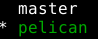

Title: Trabalhando colaborativamente com Git e GitHub
Date: 06-09-2016 22:01
Category: Controle de Versão
Tags: Git, GitHub

Alguns posts atrás falei um pouco sobre Git e GitHub mostrando
alguns conceitos básicos e um fluxo de trabalho para projetos
simples e, geralmente, individuais.

Neste post pretendo apresentar um fluxo de trabalho mais voltado
para projetos envolvendo várias pessoas.

## Branches
Antes de falar sobre este tópico é importante falar uma
funcionalidade do Git (e de outros sistemas de controle de
versão): [`branch`](https://en.wikipedia.org/wiki/Branching_%28version_control%29).
Uma branch é uma cópia do repositório que permitem que modificaçẽs
sejam feitas em paralelo na branch original e na nova gerada. Por
padrão repositórios Git trabalham na branch `master`. Esta branch
é geralmente usada para manter uma versão mais estável do projeto,
sem funcionalidades instáveis ou em fase experimental.

O comando git usando para manipular branches é, como esperado,
[`git branch`](https://git-scm.com/docs/git-branch). Sem nenhuma
opção ele lista todas as branches existentes e destaca a branch
em uso. Por exemplo, num repositório com as branches `master` e
`pelican` com a segunda em uso, o comando `git branch` exibiria:



Para criar uma branch usamos `git branch nome-da-nova-branch`,
para mudar de branch em uso
[`git checkout`](https://git-scm.com/docs/git-checkout).
Uma tarefa bem comum é criar uma nova branch, geralmente para
algum tipo de experimento ou correção, e defini-la como corrente.
Isto pode ser feito da seguinte forma:
```bash
git branch nova-branch
git checkout nova-branch
```
Como esta é uma tarefa bastante comum, há um atalho para isso.
```bash
git checkout -b nova-branch
```
É possível, e em alguns casos muito útil, fazer o checkout de
apenas alguns arquivos de uma determinada branch. A sintaxe
para isto é:
```bash
git checkout uma-branch-qualquer -- arquivo
```

## Colaboração com branches
Uma forma bastante interessante de melhorar a colaboração num
projeto é usando branches. É possível usar apenas um repositório
central (no GitHub) e, ainda assim, manter a organização.

A estatégia é:
  * Usar uma branch nova para cada funcionalidade ou correção
  * Fazer push desta branch para o respositório no GitHub
  * Abrir um Pull Request desta branch para master.

Imaginando que queremos implementar uma funcionalidade
X, podemos fazer (localmente):
```bash
git checkout -b X
# Fazer as alterações
git add arquivos
git commit -m "Implementada funcionalidade X"
git push -u origin X
```

A última linha criará a branch no GitHub, se não existir,
e enviará as alterações feitas localmente a esta branch remota.
Feito isto é possível abrir um `Pull Request` no GitHub,
possibiliando discutir o código antes do merge com a master.

Se necessário adicionar mais modificações ao mesmo
pull request basta fazer mais pushes na branch e eles
serão adicionados automagicamente.
